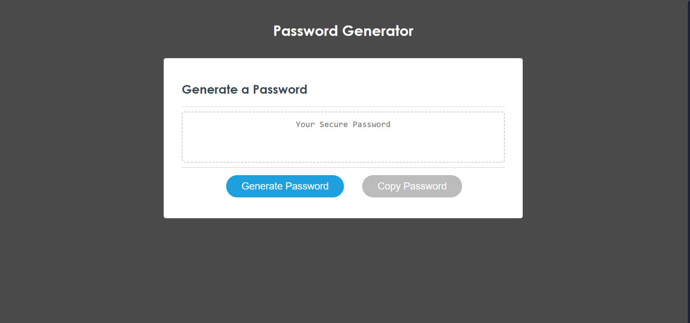

# JavaScript Code Quiz
## Description

The primary goal of this project is to create an application that can test your JavaScript knowledge! Using Javascript, HTML, CSS, I've created a relatively visual appealing code quiz that is timed, keeps track of points for each question, and has a scoreboard that displays local high scores.

## Installation

You can open the webpage in your web browser using this URL: 

## Usage
Features implemented on this webpage:
* When the game is started, a timer of 60 second displays and shows time left for the quiz
* When answers are selected, an message pops up at the bottom of the window to indicate whether you answered the question correctly or incorrectly
* The game ends when the user answers all 10 questions or the timer runs out.
* The user can submit their high score by entering their name/initials on the high score page.
* By clicking the "highscores" button on the top left, the user can view highscores for the quiz at any time. High scores are saved and will display even when application is closed.

## Credits
Referenced the following resources to complete this project:
* https://stackoverflow.com/questions/3715047/how-to-reload-a-page-using-javascript
* https://developer.mozilla.org/en-US/docs/Web/JavaScript/Reference/Global_Objects/Array/forEach
* NU Coding Bootcamp Tutor, Juno Nguyen, for helping me with setting up some of the logic for functionality
* Student support Staff, Maverick, for helping me troubleshoot a feature
* https://www.youtube.com/watch?v=DFhmNLKwwGw&ab_channel=JamesQQuick
* https://stackoverflow.com/questions/46141450/create-li-from-loop-through-array-and-display-to-html-as-a-list

## License
Please refer to the LICENSE in the repo.
